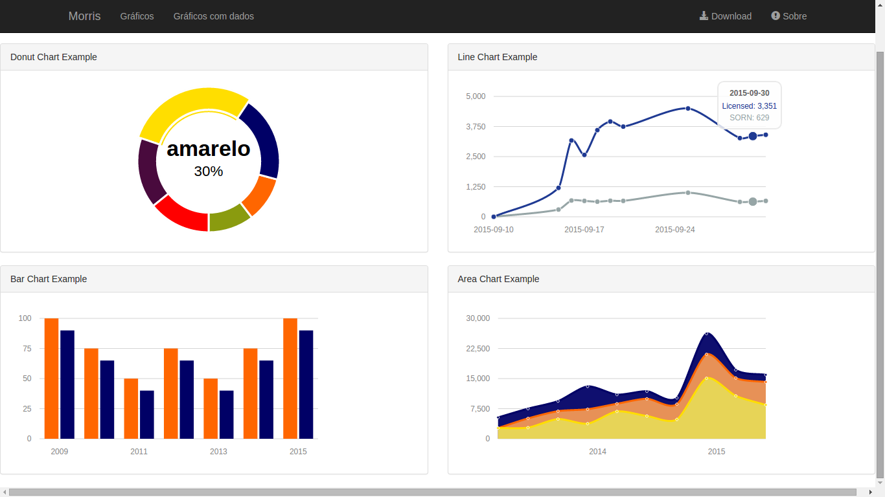

# morris.js

Example usage [morris.js][0].

[Live Demo][1]

*Django 1.7 e Python 3.4*

	$ git clone https://github.com/rg3915/morris.git
	$ virtualenv -p python3 morris
	$ cd morris
	$ source bin/activate
	$ pip install -r requirements.txt
	$ python manage.py makemigrations core
	$ python manage.py migrate
	$ python manage.py createsuperuser
	$ python manage.py loaddata fixtures.json
	$ python manage.pt runserver

[0]: http://morrisjs.github.io/morris.js/
[1]: http://rg3915.github.io/morris/